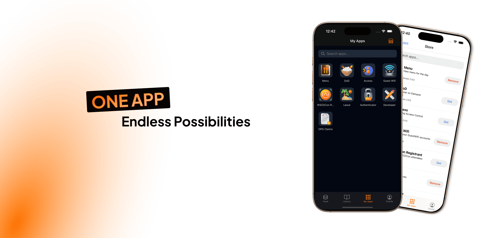
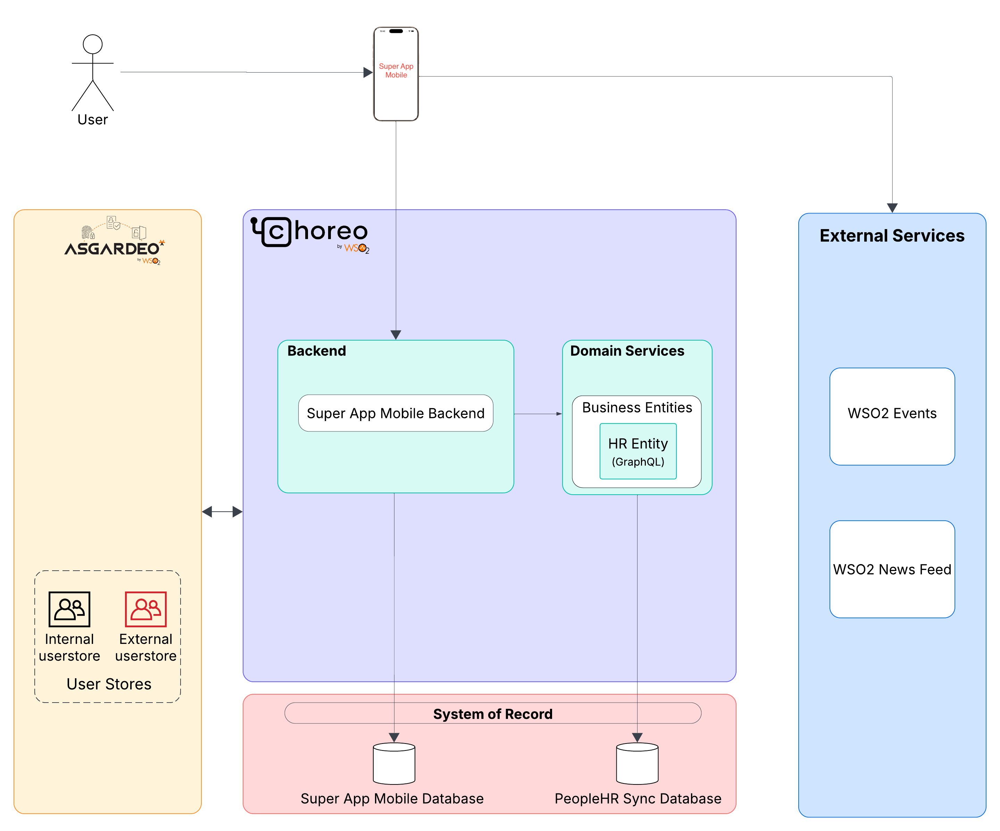

<h1 align="left">WSO2 Super App Mobile</h1>


<br></br>
<p align="left">
  <a href="https://opensource.org/license/apache-2-0">
    
  </a>
  <a href="https://twitter.com/intent/follow?screen_name=wso2" rel="nofollow"></a>
</p>
Discover, explore, and stay connected with the latest insights and tools from the tech ecosystem through the WSO2 Mobile App. Stay up to date with WSO2 news, product announcements, and upcoming events via the Feed tab. Explore curated blogs in the Library tab to gain insights into industry trends, success stories, and expert opinions. Access a suite of purpose built micro-apps to enhance your digital experience and manage your profile effortlessly all within a single unified platform.
<br></br>
This repository serves as the foundation for hosting multiple micro-apps with seamless authentication, integration, and centralized management.

---

## 🧭 Project Structure

```bash
.
├── backend                  # Ballerina backend service
│   └── README.md            # Detailed backend documentation
├── frontend                 # React Native Super App
│   └── README.md            # Detailed frontend documentation
├── README.md                # You're here
```

## ⚙️ Technologies Used

### Backend
- **Language**: [Ballerina](https://ballerina.io/)
- **Authentication**: Handled via [Asgardeo](https://wso2.com/asgardeo/)
- **Deployment**: Hosted on [Choreo](https://wso2.com/choreo/)

### Frontend
- **Framework**: React Native (Expo)
- **State Management**: Redux with Thunk
- Micro-app management, token exchange, and secure storage


## 🧱 System Architecture

Here’s a high-level view of the flow:
<br></br>


## 🚀 Getting Started

Each part of this repository has its own setup guide:

- [Frontend](./frontend/README.md)
- [Backend](./backend/README.md)

## 🐞 Reporting Issues

###  1. Opening an issue

All known issues of WSO2 Superapp Mobile are filed at: https://github.com/wso2-open-operations/superapp-mobile/issues. Please check this list before opening a new issue.

### 2.  Reporting security issues

Please do not report security issues via GitHub issues. Instead, follow the [WSO2 Security Vulnerability Reporting Guidelines](https://security.docs.wso2.com/en/latest/security-reporting/vulnerability-reporting-guidelines/).

## 🤝 Contributing

If you are planning on contributing to the development efforts of WSO2 Superapp Mobile, you can do so by checking out the latest development version. The main branch holds the latest unreleased source code.
