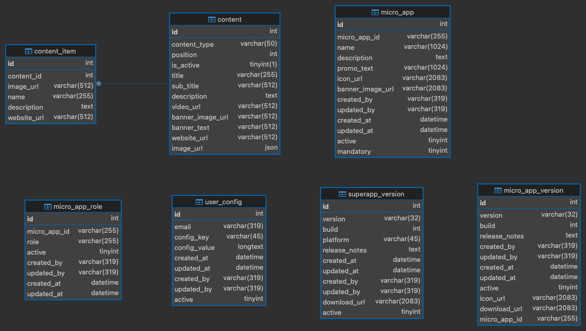

# Super App Mobile Backend

This is the Ballerina based backend for the Superapp Mobile. It powers the mobile experience by exposing RESTful APIs, integrating with databases, and retrieving entity information from internal services. The backend is modular and designed for scalability, security, and reusability across multiple micro apps.

## 🧱 Project Structure
```bash
backend/
├── Ballerina.toml # Ballerina project metadata and dependency configuration
├── Dependencies.toml # Auto generated file that records the resolved dependencies of the project
├── service.bal # Main service layer exposing HTTP endpoints
├── utils.bal # Common utility/helper functions
├── constants.bal # Common constants
├── modules
│   ├── database/ # Database access module
│   ├── entity/ # Integration with entity domain module to retrieve user data
```

## 🛠️ Setup

- Install the ballerina version mentioned in the `Ballerina.toml` file.
```bash
cd backend
bal build
```
- Configure the configurations using `config.toml` file as per the `config.toml.local`.

```bash
bal run
```

## 📘 Available API Endpoints
- The following is a summary of the backend API routes, including their purpose and return types. All endpoints use JWT-based authentication.

| Endpoint                 | Method | Description                                           | Response Type |
|--------------------------|--------|-------------------------------------------------------|---------------|
| `/user-info`             | GET    | Fetch user information of the logged-in user          | `Employee`    |
| `/micro-apps`            | GET    | Retrieve all micro apps available to the user         | `MicroApp[]`  |
| `/micro-apps/{appId}`    | GET    | Retrieve details of a specific micro app by App ID    | `MicroApp`    |
| `/versions?platform={ios/android}` | GET    | Retrieve Super App version info for a platform        | `Version[]`   |
| `/users/app-configs`     | GET    | Fetch user's downloaded micro app configurations      | `AppConfig[]` |
| `/users/app-configs`     | POST   | Add/update user's downloaded micro app configurations | `201 Created` |

## 📦 Schema Definitions
  

| Table Name             | Description                                                                                           |
|------------------------|-------------------------------------------------------------------------------------------------------|
| **Micro_app**          | Stores micro app details, including micro app ID, name, description, promo text, icon URL, and banner image URL. |
| **Micro_app_role**     | Manages micro app accessibility based on specific user groups (e.g., Asgardeo groups), allowing apps to be specialized for certain groups. |
| **Superapp_version**   | Stores release versions, release notes, and other details about the Super App.                        |
| **Micro_app_version**  | Stores release versions, release notes, and other details about micro-apps.                           |
| **User_config**        | Stores user details and configurations for the Super App.                                             |

---
  