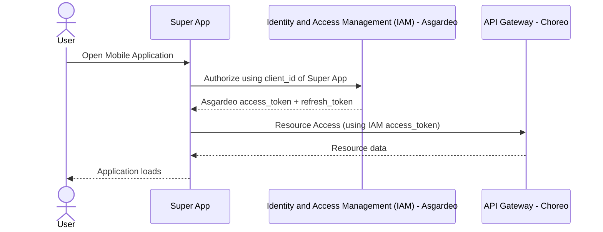
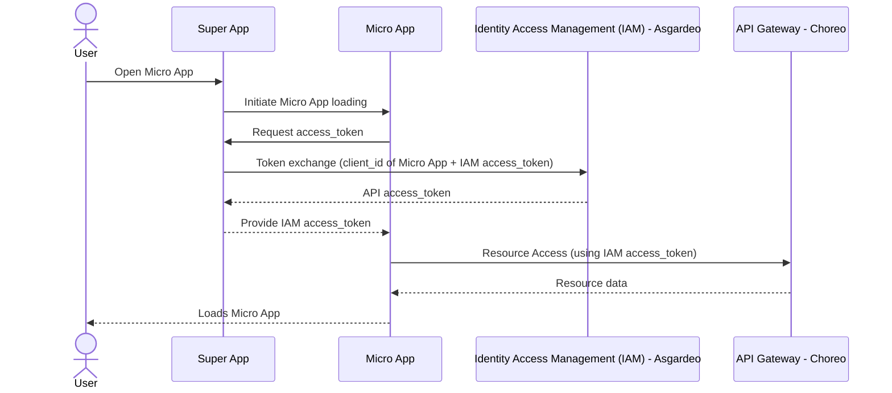

# 🚀 Super App Mobile (React Native \+ Expo)

The **Mobile App** is an all-in-one platform designed to bring essential tools and services to your fingertips for a seamless mobile experience. Built with **React Native \+ Expo** , **TypeScript**, and **Redux**, this Super App integrates secure authentication via **Asgardeo**, a micro-app architecture, and a dynamic app store for downloading and managing features.

---

## 📌 Super App Mobile Overview

This Super App serves as a **container** for multiple micro-apps. It:

- Authenticates users using **Asgardeo IAM**.  
- Fetches and downloads **micro-apps** from a store.  
- Handles **micro-app authentication and token exchange**.  
- Manages state using **Redux** with **Redux Thunk**.  
- Uses **AsyncStorage** for persistence (small client side storage needs, not as a replacement for a dedicated database)

---

## 🔄 Super App Mobile Flow

### **High-Level Overview**

1. User installs & opens the app for the first time  
     
   - App fetches **latest events and news** and **caches** them for 24 hours.

   

2. Default landing tab is `FEED`  
     
   - If user **is not authenticated**, no apps are shown.

   

3. User can navigate:  
     
   - To **Library** tab → Articles are fetched from **Library API**.  
   - To **Store/Profile** tabs → Prompt to **Sign In** is displayed.

   

4. If user signs in:  
     
   - Retrieve **access\_token & refresh\_token** via **Asgardeo IAM**.  
   - Fetch **user configurations** and **profile info**.  
   - Align locally installed apps with server-side configurations (install/uninstall accordingly).

   

5. Show:  
     
   - **My Apps** tab → User’s micro apps.  
   - **Store** tab → App management functions (update, delete, download).  
   - **Profile** tab → Profile details and sign-out option.

   

6. On re-open, the app:  
     
   - Starts at the **My Apps** tab.  
   - Checks for a **Super App force update**. If required,  the update screen is shown.  
   - Checks if any **micro-apps have updates** and updates them automatically.

---

### Super App Mobile Loading Sequence



## 📦 Micro-App Management

### How Micro-Apps Work

1. Micro-apps are listed in the Super App Store.  
2. Users can download micro-apps from the store.  
3. Downloaded micro-apps are stored using AsyncStorage.  
4. When launched, authentication tokens are exchanged for access.  
5. The micro-app uses IAM access tokens to communicate with the Choreo API Gateway.

### How Micro-App Updates Work

- The Super App Store checks for updates.  
- If an update is available, the micro-app is re-downloaded and replaced.

### Micro App Loading



---

### How to Create a Micro app

1. Micro-apps are created using **React** and should be built as static web applications.  
2. Create a new project:

```shell
npx create-react-app microapp_name
```

3. Communication with a micro app happens using a **native bridge**. Topics are used to establish a secure two way communication stream between the web based micro app and the super app. The native bridge can be found in the following path:  
   - utils/bridge.ts  
4. After creating your micro app, build it:

```shell
npm run build
```

- This will generate following files inside the `build` folder of your project.

```shell
build/
├── static/
├── index.html
├── asset-manifest.json
├── manifest.json
...
```

5. Add a `microapp.json` file to the build folder with the following attributes:

```shell
{
  "name": "Micro App Name",
  "description": "A brief description of the micro app",
  "promoText": "Promotional text for the micro app",
  "appId": "unique-app-id",
  "iconUrl": "hosting-url-for-icon.png",
  "bannerImageUrl": "hosting-url-for-banner.png",
  "isMandatory": 0,
  "clientId": "client-id-for-authentication-if-integrated",
  "versions": [
    {
      "version": "version no",
      "build": build no,
      "releaseNotes": "release notes",
      "downloadUrl": "url-to-hosted-zip-file-of-build-contents",
      "iconUrl": "hosting-url-for-version-icon.png"
    }
  ]
}
```

6. Zip the contents of the `build` directory and deploy it to your hosting site.  
     
   - Also deploy the **icon** and **banner** of your micro-app.

   

7. Update the database tables `micro_app` and `micro_app_version` with details such as:  
     
   - Micro-app ID, name, description, icon URL, banner image URL, download URL, etc.
   <br></br>
     
      

     
8. After this, you should see the deployed app in the **store**.  
     
9. Additionally , you can restrict micro-app visibility by groups using the `micro_app_role` table and mentioning groups in the role column.
   <br></br>   
    
    

---

## 📂 Project Structure

```shell
.
├── README.md                 # Project documentation
├── app                       # Main application screens
│   ├── (tabs)                # Tab navigation screens
│   │   ├── _layout.tsx       # Layout configuration for tab screens
│   │   ├── index.tsx         # Home tab screen
│   │   └── settings.tsx      # Settings tab screen
│   ├── +not-found.tsx        # Not Found (404) screen
│   ├── app-store.tsx         # Micro-app store screen
│   ├── index.tsx             # Entry point of the app
│   └── micro-app.tsx         # Micro-app management screen
├── components                # Reusable UI components
├── constants                 # Static configuration and constants
├── context                   # Redux store and slices
├── hooks                     # Custom React hooks
├── services                  # API service handlers
├── utils                     # Utility functions
```

### Folder Descriptions

- `app/` → Contains screens and navigation logic.  
- `components/` → Reusable UI components (widgets, buttons, etc.).  
- `context/` → Manages global state using Redux.  
- `services/` → Handles API requests (authentication, app store, etc.).  
- `utils/` → Utility functions (encryption, request handlers, etc.).

### File Naming Conventions

- Components: `PascalCase.tsx` (e.g., `ListItem.tsx`, `Widget.tsx`)  
- Screens/Pages: `kebab-case.tsx` (e.g., `app-store.tsx`, `micro-app.tsx`)  
- Hooks: `camelCase.ts` (e.g., `useThemeColor.ts`)  
- Services & Utils: `camelCase.ts` (e.g., `authService.ts`, `requestHandler.ts`)  
- Redux Slices: `camelCaseSlice.ts` (e.g., `authSlice.ts`)  
- Constants: `PascalCase.ts` (e.g., `Colors.ts`, `Constants.ts`)

## ⚙️ Environment Variables (`.env`)

Create a `.env` file and set up the required environment variables:

```
EXPO_PUBLIC_CLIENT_ID=<asgardeo-project-client-id> # Asgardeo Client ID
EXPO_PUBLIC_REDIRECT_URI=<redirect-uri>            # Redirect URI for authentication flow
EXPO_PUBLIC_TOKEN_URL=https://api.asgardeo.io/t/<asgardeo-organization>/oauth2/token
EXPO_PUBLIC_LOGOUT_URL=https://api.asgardeo.io/t/<asgardeo-organization>/oidc/logout
EXPO_PUBLIC_BACKEND_BASE_URL=<backend-url>         # Backend API Base URL

EXPO_PUBLIC_LIBRARY_ARTICLE_FALLBACK_IMAGE=
EXPO_PUBLIC_DEVELOPER_APP_DEFAULT_URL=

# Authenticator app related URLs
EXPO_PUBLIC_GOOGLE_IOS_CLIENT_ID=<google-ios-client-id>
EXPO_PUBLIC_GOOGLE_ANDROID_CLIENT_ID=<google-android-client-id>
EXPO_PUBLIC_GOOGLE_WEB_CLIENT_ID=<google-web-client-id>
EXPO_PUBLIC_GOOGLE_ACCESS_TOKEN_KEY=<google-access-token-key>
EXPO_PUBLIC_GOOGLE_REFRESH_TOKEN_KEY=<google-refresh-token-key>
EXPO_PUBLIC_GOOGLE_USER_INFO_KEY=<google-user-info-key>
EXPO_PUBLIC_GOOGLE_USER_INFO_URL=<google-user-info-url>
EXPO_PUBLIC_GOOGLE_TOKEN_URL=<google-token-url>
EXPO_PUBLIC_GOOGLE_DRIVE_UPLOAD_URL=<google-drive-upload-url>
EXPO_PUBLIC_GOOGLE_DRIVE_LIST_FILES_URL=<google-drive-list-url>
EXPO_PUBLIC_GOOGLE_TOKEN_INFO_URL=<google-token-info-url>
EXPO_PUBLIC_GOOGLE_DRIVE_FILE_DOWNLOAD_URL=<google-drive-file-download-url>
EXPO_PUBLIC_MICRO_APP_STORAGE_DIR=<directory-name-to-store-microapps>

# Feed tab URLs
EXPO_PUBLIC_EVENTS_URL=<events-url>
EXPO_PUBLIC_NEWS_URL=<news-url>
EXPO_PUBLIC_LIBRARY_URL=<base-url-for-library-related-operations> 
EXPO_PUBLIC_ARTICLE_BASE_URL=<base-url-for-article-related-operations> 

```

## 🚀 Getting Started

1. Install dependencies

```shell
npm install
```

2. Set up `.env` file

```shell
cp .env.example .env
```

   Fill in the necessary values.

   

3. If you do not plan to use the `@react-native-google-signin/google-signin` plugin, please remove the following code block from `app.json`. If you are using it, update the `iosUrlScheme` value accordingly.  
 


```shell
  [
    "@react-native-google-signin/google-signin",
    {
      "iosUrlScheme": "<google-ios-url-scheme>"
    }
  ]
```

   

4. Start the app

```shell
 npx expo start
```

In the output, you'll find options to open the app in a

- [Development build](https://docs.expo.dev/develop/development-builds/introduction/)  
- [Android emulator](https://docs.expo.dev/workflow/android-studio-emulator/)  
- [iOS simulator](https://docs.expo.dev/workflow/ios-simulator/)  
- [Expo Go](https://expo.dev/go), a limited sandbox for trying out app development with Expo

You can start development by editing the files inside the **app** directory. This project uses [file-based routing](https://docs.expo.dev/router/introduction).

---

## Deployment

1. Update `app.json`  
- Modify values such as app name, version, slug, package name, etc., according to your project.  
2. Follow the official Expo documentation for the next steps  
- https://docs.expo.dev/build/setup/

---

## 🛠️ Debugging & Common Issues

### Authentication Issues

❌ **Problem**: Login fails or returns an error.  
✅ **Solution**:

- Ensure `EXPO_PUBLIC_CLIENT_ID` and `EXPO_PUBLIC_REDIRECT_URI` are correct.  
- Check Asgardeo configurations (Redirect URIs & OAuth settings).

### Micro-App Download Fails

❌ **Problem**: Micro-apps are not downloading.  
✅ **Solution**:

- Ensure the backend API (`EXPO_PUBLIC_BACKEND_BASE_URL`) is reachable.  
- Check storage permissions if using file system storage.

---
