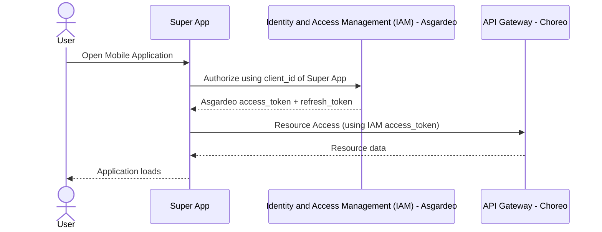
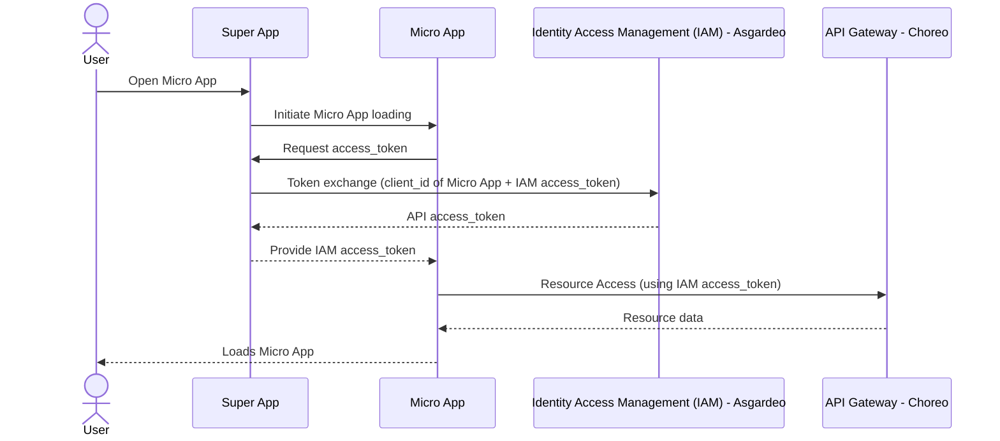
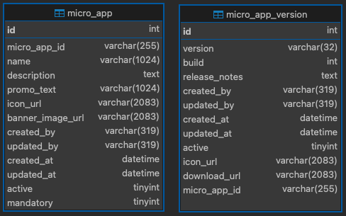
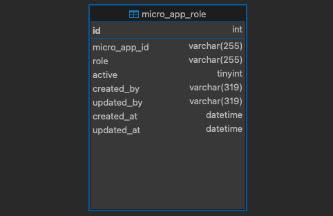

# 🚀 Super App Mobile (React Native \+ Expo)

The **Mobile App** is an all-in-one platform designed to bring essential tools and services to your fingertips for a seamless mobile experience. Built with **React Native + Expo**, **TypeScript**, and **Redux**, this Super App integrates secure authentication via **Asgardeo**, a micro-app architecture, and a dynamic app store for downloading and managing features.

---

## 📌 Super App Mobile Overview

This Super App serves as a **container** for multiple micro-apps. It:

- Authenticates users using **Asgardeo IAM**.
- Fetches and downloads **micro-apps** from a store.
- Handles **micro-app authentication and token exchange**.
- Manages state using **Redux** with **Redux Thunk**.
- Uses **AsyncStorage** for persistence (small client side storage needs, not as a replacement for a dedicated database).
- Supports **time-based local notifications** for scheduled sessions.  
  -- You can store sessions in the following format:

      {
         "data": [
            { "id": "1", "startTime": "2025-09-29 08:00:00.000000", "title": "Session Title" },
            { "id": "2", "startTime": "2025-09-29 07:52:00.000000", "title": "Another Session" }
         ],
         "superapp_notification_title": "Scheduled notification title(This value defines the default title text that will appear)"
      }

-- A notification will automatically be sent **10 minutes before each session**.

---

## 🔄 Super App Mobile Flow

### **High-Level Overview**

1. User installs & opens the app for the first time

   - App fetches **latest events and news** and **caches** them for 24 hours.

2. Default landing tab is `FEED`

3. User can navigate:

   - To **Library** tab → Articles are fetched from **Library API**.
   - To **Store/Profile** tabs → Prompt to **Sign In** is displayed.

4. If user signs in:

   - Retrieve **access_token & refresh_token** via **Asgardeo IAM**.
   - Fetch **user configurations** and **profile info**.
   - Align locally installed apps with server-side configurations (install/uninstall accordingly).

5. Show:

   - **My Apps** tab → User's micro apps.
   - **Store** tab → App management functions (update, delete, download).
   - **Profile** tab → Profile details and sign-out option.

6. On re-open, the app:

   - Starts at the **My Apps** tab.
   - Checks for a **Super App force update**. If required, the update screen is shown.
   - Checks if any **micro-apps have updates** and updates them automatically.

---

### Super App Mobile Loading Sequence



## 📦 Micro-App Management

### How Micro-Apps Work

1. Micro-apps are listed in the Super App Store.
2. Users can download micro-apps from the store.
3. Downloaded micro-apps are stored using AsyncStorage.
4. When launched, authentication tokens are exchanged for access.
5. The micro-app uses IAM access tokens to communicate with the Choreo API Gateway.

### How Micro-App Updates Work

- The Super App Store checks for updates.
- If an update is available, the micro-app is re-downloaded and replaced.

### Micro App Loading



---

### How to Create a Micro app

1. Micro-apps are created using **React** and should be built as static web applications.

2. Create a new project:

```shell
npx create-react-app microapp_name
```

3. Communication with a micro app happens using a **native bridge**. Topics are used to establish a secure two way communication stream between the web based micro app and the super app. The native bridge can be found in the following path:

   - `utils/bridge.ts`

4. After creating your micro app, build it:

```shell
npm run build
```

- This will generate following files inside the `build` folder of your project.

```shell
build/
├── static/
├── index.html
├── asset-manifest.json
├── manifest.json
...
```

5. Add a `microapp.json` file to the build folder with the following attributes:

```json
{
  "name": "Micro App Name",
  "description": "A brief description of the micro app",
  "promoText": "Promotional text for the micro app",
  "appId": "unique-app-id",
  "iconUrl": "hosting-url-for-icon.png",
  "bannerImageUrl": "hosting-url-for-banner.png",
  "isMandatory": 0,
  "clientId": "client-id-for-authentication-if-integrated",
  "displayMode": "Controls whether to hide the header ('fullscreen') or show it ('default'). If no value is provided, it defaults to 'default'",
  "versions": [
    {
      "version": "version no",
      "build": "build no",
      "releaseNotes": "release notes",
      "downloadUrl": "url-to-hosted-zip-file-of-build-contents",
      "iconUrl": "hosting-url-for-version-icon.png"
    }
  ]
}
```

6. Zip the contents of the `build` directory and deploy it to your hosting site.

   - Also deploy the **icon** and **banner** of your micro-app.

7. Update the database tables `micro_app` and `micro_app_version` with details such as:

   - Micro-app ID, name, description, icon URL, banner image URL, download URL, etc.

   <br></br>
   

8. After this, you should see the deployed app in the **store**.

9. Additionally, you can restrict micro-app visibility by groups using the `micro_app_role` table and mentioning groups in the role column.
   <br></br>
   

---

## 📂 Project Structure

```shell
.
├── README.md                 # Project documentation
├── app                       # Main application screens
│   ├── (tabs)                # Tab navigation screens
│   │   ├── _layout.tsx       # Layout configuration for tab screens
│   │   ├── index.tsx         # Home tab screen
│   │   └── settings.tsx      # Settings tab screen
│   ├── +not-found.tsx        # Not Found (404) screen
│   ├── app-store.tsx         # Micro-app store screen
│   ├── index.tsx             # Entry point of the app
│   └── micro-app.tsx         # Micro-app management screen
├── components                # Reusable UI components
├── constants                 # Static configuration and constants
├── context                   # Redux store and slices
├── hooks                     # Custom React hooks
├── services                  # API service handlers
├── utils                     # Utility functions
```

### Folder Descriptions

- `app/` → Contains screens and navigation logic.
- `components/` → Reusable UI components (widgets, buttons, etc.).
- `context/` → Manages global state using Redux.
- `services/` → Handles API requests (authentication, app store, etc.).
- `utils/` → Utility functions (encryption, request handlers, etc.).

### File Naming Conventions

- Components: `PascalCase.tsx` (e.g., `ListItem.tsx`, `Widget.tsx`)
- Screens/Pages: `kebab-case.tsx` (e.g., `app-store.tsx`, `micro-app.tsx`)
- Hooks: `camelCase.ts` (e.g., `useThemeColor.ts`)
- Services & Utils: `camelCase.ts` (e.g., `authService.ts`, `requestHandler.ts`)
- Redux Slices: `camelCaseSlice.ts` (e.g., `authSlice.ts`)
- Constants: `PascalCase.ts` (e.g., `Colors.ts`, `Constants.ts`)

---

## 🚀 Getting Started

Follow these steps to set up and run the project locally.

### 1. Create and Configure the Environment File

First, copy the example environment file to create your local configuration:

```bash
cp .env.example .env
```

- This will create a `.env` file. Make sure to update the values according to your project requirements.
- Please note that the authenticator app–related URL in `.env` is required only for the WSO2 Super App. If your app does not need it, you can safely remove those variables.

#### 1.1. (Optional) How to add/remove Firebase plugins if you are using Firebase.

To add or remove Firebase plugins from your app, open the `frontend/integrations/firebase/withFirebase.ts` file. In this file, you will find a constant named `FIREBASE_PLUGINS`, which contains an array of strings corresponding to each Firebase plugin. Modifying this array by adding or removing a plugin's corresponding string will add or remove the plugin from the app.

#### 1.2. (Optional) If you are using `Firebase Services`, enable the feature flag in the `.env` file:

```bash
EXPO_PUBLIC_ENABLE_FIREBASE=true
```

> Note: An `npx expo prebuild` should be executed each time this value is updated to apply the config changes.

#### 1.3. (Optional) If you are using `Firebase Services`, generate Base64 for Firebase Configuration

To use Firebase services, you need to convert your `GoogleService-Info.plist` (iOS) and `google-services.json` (Android) files into Base64 strings.

##### 1.3.1 On MacOS

```bash
# For iOS: Encodes the file and copies the string to your clipboard
base64 -i path/to/your/GoogleService-Info.plist | tr -d '\n' | pbcopy

# For Android: Encodes the file and copies the string to your clipboard
base64 -i path/to/your/google-services.json | tr -d '\n' | pbcopy
```

##### 1.3.2 On Linux

```bash
# For iOS: Encodes the file and prints the string to the terminal
base64 -w 0 path/to/your/GoogleService-Info.plist

# For Android: Encodes the file and prints the string to the terminal
base64 -w 0 path/to/your/google-services.json
```

##### 1.3.3 On Windows (using PowerShell):

```powershell
# For iOS:
[Convert]::ToBase64String([IO.File]::ReadAllBytes("path\to\your\GoogleService-Info.plist"))

# For Android:
[Convert]::ToBase64String([IO.File]::ReadAllBytes("path\to\your\google-services.json"))
```

Paste the generated strings into the `FIREBASE_IOS_PLIST_B64` and `FIREBASE_ANDROID_JSON_B64` variables in your `.env` file.

### 2. Update the `app.config.ts` file with plugins

If you use Firebase **OR** _any other library_ that requires `config plugins` or `custom native modules`, you must add the necessary plugins to your `app.config.ts` file. For specific instructions on the Firebase setup, refer to the official [React Native Firebase](https://rnfirebase.io/) documentation.

See an example of how to add the Firebase plugins to the Plugins array:

```json
"plugins": [
   "plugin-1",
   "plugin-2",
   "plugin-3",
   [
      "plugin-4-with-configs",
      {
         {"some_configuration": true}
      }
   ]
]
```

### 3. Install Dependencies

With your `.env` file configured, run the following command to install all necessary packages.

```bash
npm install
```

> **Note:** The `postinstall` script will automatically run, which performs two key actions:
>
> 1. If provided, it decodes the `FIREBASE_IOS_PLIST_B64` and `FIREBASE_ANDROID_JSON_B64` variables from your `.env` file and creates the `google-services/GoogleService-Info.plist` and `google-services/google-services.json` files.
> 2. It installs dependencies in the root directory to set up Husky for pre-commit hooks.

### 4. Start the Application

You are now ready to start the Expo development server:

```bash
npx expo start

# npx expo run:{ios/android} if you are using native modules
```

In the output, you'll find options to open the app in a

- [Development build](https://docs.expo.dev/develop/development-builds/introduction/)
- [Android emulator](https://docs.expo.dev/workflow/android-studio-emulator/)
- [iOS simulator](https://docs.expo.dev/workflow/ios-simulator/)
- [Expo Go](https://expo.dev/go), a limited sandbox for trying out app development with Expo

You can start development by editing the files inside the **app** directory. This project uses [file-based routing](https://docs.expo.dev/router/introduction).

---

## Deployment

1. Update `app.config.ts`.

   - Modify values such as app name, version, slug, package name, etc., according to your project through the `.env` file.

2. Follow the official Expo documentation for the next steps.

   - https://docs.expo.dev/build/setup/

---

## 🛠️ Debugging & Common Issues

### Authentication Issues

❌ **Problem**: Login fails or returns an error.  
✅ **Solution**:

- Ensure `EXPO_PUBLIC_CLIENT_ID` and `EXPO_PUBLIC_REDIRECT_URI` are correct.
- Check Asgardeo configurations (Redirect URIs & OAuth settings).

### Micro-App Download Fails

❌ **Problem**: Micro-apps are not downloading.  
✅ **Solution**:

- Ensure the backend API (`EXPO_PUBLIC_BACKEND_BASE_URL`) is reachable.
- Check storage permissions if using file system storage.

### Firebase Files Not Found

❌ **Problem**: The build fails with an error indicating `GoogleService-Info.plist` or `google-services.json` is missing.  
✅ **Solution**:

- Ensure the `FIREBASE_IOS_PLIST_B64` and `FIREBASE_ANDROID_JSON_B64` variables in your `.env` file are not empty and contain valid Base64 strings.
- Try running `npm run write-firebase-files` manually to regenerate the files.
- If the issue persists, delete the `node_modules` directory and run `npm install` again.

### Firebase Plugin errors

❌ **Problem**: The build fails with an error caused by a firebase plugin during `npx expo prebuild` or `npx expo prebuild --clean`

✅ **Solution**: It was noticed that some firebase modules don't need to be added into the plugin list in the `app.config.js`. Remove the package and try re-running the commands
