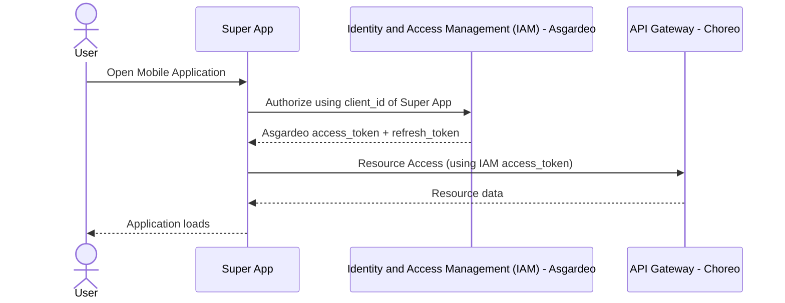
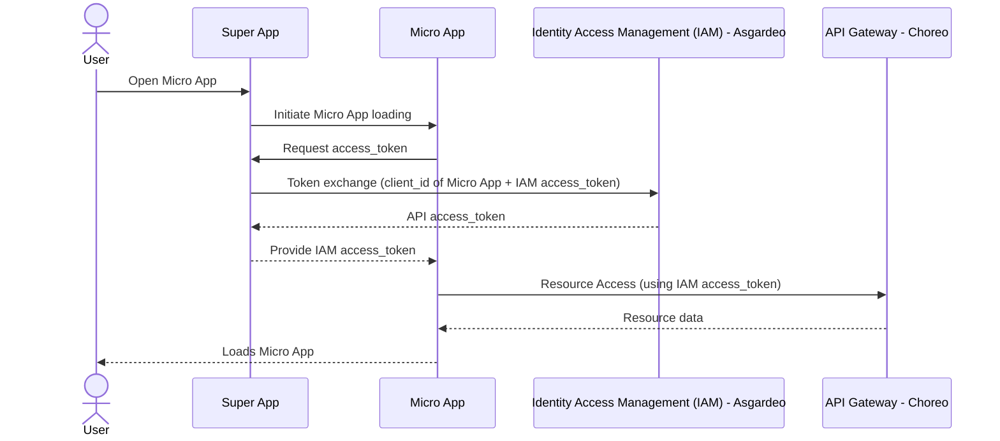

# 🚀 WSO2 Super App Mobile (React Native Expo)

The **WSO2 Mobile App** is an all-in-one platform designed to bring essential tools and services to your fingertips for a seamless mobile experience. Built with **React Native Expo**, **TypeScript**, and **Redux**, this Super App integrates secure authentication via **Asgardeo**, a micro-app architecture, and a dynamic app store for downloading and managing features.

---

## 📢 What’s New in This Release

The new WSO2 Mobile App is designed to streamline your digital experience. Here's a quick overview of what's included:

- **Feed**: Stay informed with the latest WSO2 news and upcoming events.
- **Library**: Discover curated blogs covering industry trends, success stories, and expert insights.
- **My Apps**: Access a variety of apps to enhance your digital experience.
- **Profile**: Easily manage your profile and preferences.

✨ **Passkey Authentication is Now Supported with Asgardeo**  
Enjoy passwordless, phishing-resistant sign-ins using FIDO2/WebAuthn for a more secure and seamless login experience.

---

## 📌 Super App Mobile Overview

This Super App serves as a **container** for multiple micro-apps. It:

- Authenticates users using **Asgardeo IAM**.
- Fetches and downloads **micro-apps** from a store.
- Handles **micro-app authentication and token exchange**.
- Manages state using **Redux** with **Redux Thunk**.
- Uses **AsyncStorage** for persistence.

---

## 🔄 Super App Mobile Flow

### **High-Level Overview**

1. User installs & opens the app for the first time

   - App fetches **latest events and news** from wso2.com and **caches** them for 24 hours.

2. Default landing tab is `My Apps`

   - If user **is not authenticated**, no apps are shown.

3. User can navigate:

   - To **Library** tab → Articles are fetched from **WSO2 Library API**.
   - To **Store/Profile** tabs → Prompt to **Sign In** is displayed.

4. If user signs in:

   - Retrieve **access_token & refresh_token** via **Asgardeo IAM**.
   - Fetch **user configurations** and **profile info**.
   - Align locally installed apps with server-side configurations (install/uninstall accordingly).

5. Show:

   - **My Apps** tab → User’s micro apps.
   - **Store** tab → App management functions (update, delete, download).
   - **Profile** tab → Profile details and sign-out option.

6. On re-open, the app:
   - Starts at **My Apps** tab.
   - Checks for a **Super App force update**. If required, shows update screen.
   - Checks if any **micro-apps have updates** and updates them automatically.

---

### Super App Mobile Loading Sequence



## 📦 Micro-App Management

### How Micro-Apps Work

1. Micro-apps are listed in the Super App Store.
2. Users can download micro-apps from the store.
3. Downloaded micro-apps are stored using AsyncStorage.
4. When launched, authentication tokens are exchanged for access.
5. The micro-app uses IAM access tokens to communicate with the Choreo API Gateway.

### How Micro-App Updates Work

- The Super App Store checks for updates.
- If an update is available, the micro-app is re-downloaded and replaced.

### Micro App Loading



## 📂 Project Structure

```bash
.
├── README.md                 # Project documentation
├── app                       # Main application screens
│   ├── (tabs)                # Tab navigation screens
│   │   ├── _layout.tsx       # Layout configuration for tab screens
│   │   ├── index.tsx         # Home tab screen
│   │   └── settings.tsx      # Settings tab screen
│   ├── +not-found.tsx        # Not Found (404) screen
│   ├── app-store.tsx         # Micro-app store screen
│   ├── index.tsx             # Entry point of the app
│   └── micro-app.tsx         # Micro-app management screen
├── components                # Reusable UI components
├── constants                 # Static configuration and constants
├── context                   # Redux store and slices
├── hooks                     # Custom React hooks
├── services                  # API service handlers
├── utils                     # Utility functions
```

### Folder Descriptions

- `app/` → Contains screens and navigation logic.
- `components/` → Reusable UI components (widgets, buttons, etc.).
- `context/` → Manages global state using Redux.
- `services/` → Handles API requests (authentication, app store, etc.).
- `utils/` → Utility functions (encryption, request handlers, etc.).

### File Naming Conventions

- Components: `PascalCase.tsx` (e.g., `ListItem.tsx`, `Widget.tsx`)
- Screens/Pages: `kebab-case.tsx` (e.g., `app-store.tsx`, `micro-app.tsx`)
- Hooks: `camelCase.ts` (e.g., `useThemeColor.ts`)
- Services & Utils: `camelCase.ts` (e.g., `authService.ts`, `requestHandler.ts`)
- Redux Slices: `camelCaseSlice.ts` (e.g., `authSlice.ts`)
- Constants: `PascalCase.ts` (e.g., `Colors.ts`, `Constants.ts`)

## ⚙️ Environment Variables (`.env`)

Create a `.env` file and set up the required environment variables:

```dotenv
EXPO_PUBLIC_CLIENT_ID=<asgardeo-project-client-id> # Asgardeo Client ID
EXPO_PUBLIC_REDIRECT_URI=<redirect-uri>            # Redirect URI for authentication flow
EXPO_PUBLIC_TOKEN_URL=https://api.asgardeo.io/t/<asgardeo-organization-name>/oauth2/token
EXPO_PUBLIC_LOGOUT_URL=https://api.asgardeo.io/t/<asgardeo-organization-name>/oidc/logout
EXPO_PUBLIC_BACKEND_BASE_URL=<backend-url>         # Backend API Base URL

```

## 🚀 Getting Started

1. Install dependencies

   ```bash
   npm install
   ```

2. Set up `.env` file

   ```bash
   cp .env.example .env
   ```

   Fill in the necessary values.

3. Start the app

   ```bash
    npx expo start
   ```

In the output, you'll find options to open the app in a

- [Development build](https://docs.expo.dev/develop/development-builds/introduction/)
- [Android emulator](https://docs.expo.dev/workflow/android-studio-emulator/)
- [iOS simulator](https://docs.expo.dev/workflow/ios-simulator/)
- [Expo Go](https://expo.dev/go), a limited sandbox for trying out app development with Expo

You can start development by editing the files inside the **app** directory. This project uses [file-based routing](https://docs.expo.dev/router/introduction).

## 🛠️ Debugging & Common Issues

### Authentication Issues

❌ **Problem**: Login fails or returns an error.\
✅ **Solution**:

- Ensure `EXPO_PUBLIC_CLIENT_ID` and `EXPO_PUBLIC_REDIRECT_URI` are correct.
- Check Asgardeo configurations (Redirect URIs & OAuth settings).

### Micro-App Download Fails

❌ **Problem**: Micro-apps are not downloading.\
✅ **Solution**:

- Ensure the backend API (`EXPO_PUBLIC_BACKEND_BASE_URL`) is reachable.
- Check storage permissions if using file system storage.

---
